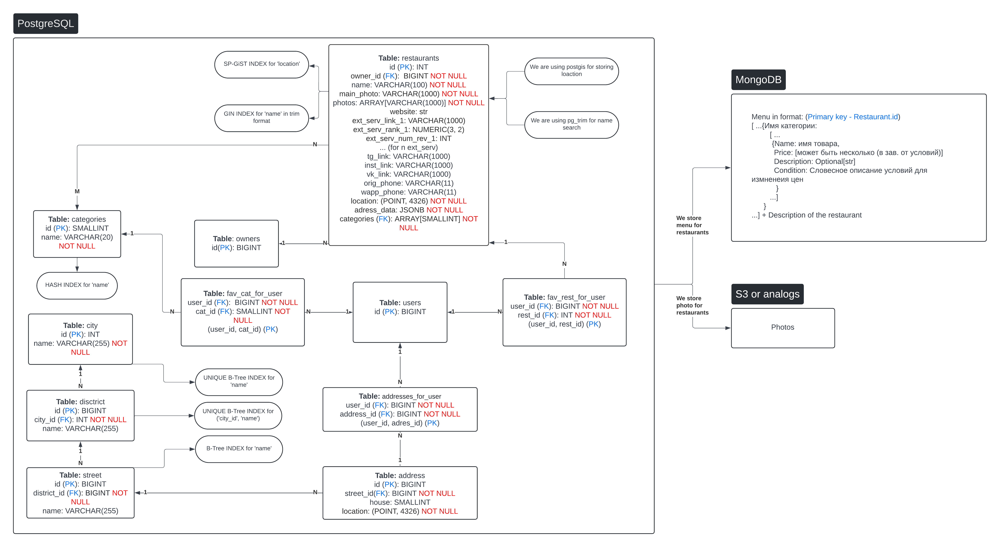

# Агрегатор ресторанов внутри Telegram MiniApps

## Intro 

Данный проект разрабатывался в рамках курса "Продвинутый Python" на ПМИ ФКН. [Ссылка](https://drive.google.com/file/d/1AvHGcyTqKBE6HdrBNByh4D1UvXLyyZKJ/view?usp=sharing) на презентацию.
В репозитории присутствует, две ветки 

- master (Является dev веткой)
- prod (Является prod веткой)

Актуальной является prod ветка, так как dev ветка на данный момент отстает от prod.

**Авторы проекта**

- Даниэль Минкин (фронтенд + бд + DevOps), tg: @MinkinDD - автор идеи
- Олег Швецов (бэкенд), tg: @olezha223 

# Стек проекта:

1. Фронтенд: 
   - React
   - Vite
   - telegram-apps/telegram-ui (для интеграции с интерфейсом тг) 
2. Бэкенд: 
   - python FastAPI (для создания API)
   - SQLAlchemy (для данных пользователей)
   - Celery (фоновые задачи)
   - Redis (для распределения нагрузки на БД и бэк при записи польз. логов)
   - aiobotocor (асинхронная S3 для изображений)

3. Базы данных:
   - PostgreSQL (Основная БД)
   - MongoDB (для меню ресторанов и их описания)

   **Внутри PostgreSQL будем использоавть pg_trim для быстрого поиска по похожим назавниям и postgis для быстрого поиска по ближайшим ресторанам**

4. Контейнеризация через Docker Compose
5. python-telegram-bot для телеграм-бота
6. Api Яндекс карт для работы с географическими данными
7. Deploy через GitHub Actions
8. NGINX в качестве обратного прокси сервера

   
# Состояние проекта 

## backend 

- фреймворк FastAPI для создания API
- SQLAlchemy и ORM для работы с PostgresSQL, подключение реализовано с помощью асинхронного контекстного менеджера
- Motor для работы с MongoDB, подключение также через асинхронный контекстный менеджер
- весь код протестирован на pytest

### Подробнее про реализацию

На бэкенде используется слоистая архитектура.

- Слой представления. В этом слое мы подготавливаем данные для представления на различных платформах, в нашем случае это будут тг бот и мини-приложение
- Слой сервиса. Подготовка данных для сохранения и дальнейшей обработки. Реализует инкапсуляцию бизнес-операций.
- Слой работы с данными. Мы абстрагируем работу с данными, что позволяет бизнес-логике не зависеть от конкретной реализации слоя работы с данными.


### Обзор файловой структуры

#### Папка src

1. **api**. В этой папке первая основная версия апи (v1), которая общается с продакшн базой данных. Каждый сервис, используемый в хендлерах прокидывается, как dependency injection (ну почти), для валидации данных используется Pydantic схемы
2. **app**. Реализация кастомного FastAPI приложение, где подключается CORS и все роутеры
3. **auth**. Функции для работы с JWT аутенфикацией: создание аксес и рефреш токенов, проверка, что запрос пришел из телеграм
4. **database**. Асинхронные коннекторы для работы с базами данных MongoDB и PostgresSQL
5. **models**. Делится на две части: DTO и ORM
    - **DTO** - data transfer object. Просто наборы pydantic моделей для разных задач, которыми обмениваются слои при общении.
    - **ORM** - ORM схемы для работы с PostgresSQL
6. **repository**. Слой репозитория. В интерфейсе определен лишь session_getter - по умолчанию это коннектор к продакшн базе, но в тестах мы можем это подменить на другой, чтобы инкапсулировать тесты.
7. **service**. Слой сервиса.

#### Тесты

- Тесты на хендлеры. Используется асинхронный клиент из httpx вместе с веб-сервером uvicorn. Для тестов написан клон API, так как было бы очень плохой идеей делать основной API так, чтобы влиять на то, с какой базой данных будет производиться работа.
- Тесты на репозиторий и сервис. Они в целом очень похожи, но в целом это обычные интеграционные тесты, которые работают с тестовой базой данных
- Всего в проекте 190 тестов, и все проходят. Сейчас осталось протестировать только ручки на хендлеры и ручки, которые будут менять свойства ресторана

### Что сейчас по задачам на бэкенде
1. понять, нужно ли допиливать jwt или все работает, как надо
2. дописать хендлеры, которые будут по одному апдейтить свойства ресторана + тесты на них
3. в целом в остальном тут все готово уже и можно ~~пить пиво~~ делать лабу по матану2


## bot
### Что сделали: 
Готова вся архитектура, однако по этой части не успеваем больше всего, из-за линейности тг ботов и как следствие необходимости прописывания каждого действия
### Что нужно сделать: 
Пока нет связки с бэком по запросам и стоят затычки. Также не готов процесс добавления ресторанов. Сейчас реализуется "наследование свойств ресторанов" при добавлении нового. Также нужно реализовать возможность редактировать рестораны, если совсем не будем успевать, опустим этот момент в пользу добавления новых, так как там интереснее функционал с точки зрения реализации. Также пока есть лишь интеграционные тесты на Storage 


## databases

### Схема бд


### Что сделали:
Подняли монгу, постгресс и редис. Добавили тестовую базу данных в постгрес для интеграционных тестов. Настроили Redis через .conf 
#### Что нужно сделать: 
Добавить аутентификацию в MongoDB, сейчас работает без нее, что unsafe 


# Как запустить проект

Создайте в корне проекта .env файл, согласно .env-example

Также создайте по образцу .env файл в директории databases и backend

Создайте приватный и публичный ключ для JWT аутенфикации:

```shell
cd backend
mkdir certs
cd certs
openssl genrsa -out jwt-private.pem 2048
openssl rsa -in jwt-private.pem -outform PEM -pubout -out jwt-public.pem
```

Теперь можно запустить докер компоуз с нашими контейнерами

```shell
docker-compose up
```

# Как протестировать проект локально

Запустите базы данных
```shell
cd databases
docker-compose up
```

## Тестирование бэкенда

```shell
cd ../backend/ # если были в папке databases
python3 -m venv venv
source venv/bin/activate
pip install -r requirements.txt
pytest -v
```
## Тестирование бота

```shell
cd ../bot/
python3 -m venv venv
source venv/bin/activate
pip install -r requirements.txt
pytest -v
```

# Изначальное видение проекта

Мы разрабатываем мини-приложение ТГ для удобной агрегации ресторанов рядом с пользователем. Весь интерфейс будет завязан на телеграм боте

## Функционал

### Для рядового пользователя:
1. Получить ближайшие рестораны к пользователю по введенному адресу 
2. Возможность выбирать любимые рестораны/категории
3. Агрегированная информация о ресторане из несколкьих источников 
4. Система рекомендаций от бота

### Для фирм:
1. Добавить/удалить/редактировать свой ресторан через бота 
2. Возможность 'наследования' свойств ресторанов для быстрого добавления новых заведений 
3. Coming soon: Эффективное продвижение для бизнеса за счет отслеживания поведения пользоавтелей 

## Сценарий взаимодействия с нашим проектом


### Основная страница 
Вся вериификация асболютно невидима для пользователя и осущесвляется единожды при входе в приложение, до заверешения сессии 

Вид страницы: 
1. Для нового пользователя

   При входе на главную страницу сервис предложит вам выбрать адрес, в то время как будут показаны рестораны которые примерно близки к вашему текущему местоположению 

2. Для старого пользователя 

   Ваш последний адрес будет сохранен и при следующем входе в приложение, будет отображена страница с ближайшими к нему ресторанами  

На данной странице доступны выбор категорий и адреса, поиск и переход на страницы пользователя и ресторана 
Данная страница всегда кэшируется при переходе на другие, поэтому выбранные категеории, введенные поисковые запросы и.т.п сохраняются, также при возврате на страницу сохраняется положение пользоавтеля на ней

Выбранные категории сохраняются и применяются при поиске

Поиск осуществляется не по точным, а по наибольшим совпадениям, что позоляет искать рестораны максимально удобно для пользоавтеля  

### Страница ресторана 
На данной странице будут продемонстрированы фотографии ресторана, его описание, ссылки на его сайт и на него в других источниках, также там будут показаны рейтинг ресторана на каждом из них, с количеством людей оставивших отзыв и агрегированный рейтинг на основе этих показателей. 

Для каждого заведения будет показан список категорий к кооторому он принадлежит

Также для каждого ресторана в развертывающемся окошке будет доступно меню

У пользователя будет возможность добавить ресторан в избранное или убрать его оттуда 

При наличии возможности, мы бы хотели ввести выкладку по отзывам со всех источников используя Api какой-либо LLM

### Страница пользователя 
Данная страница предназначена для управления всеми фишками мини-приложения

На ней можно будет добавить / удалить любимые категории / рестораны, сбросить предпочтения и.т.п

Дальнейший список функций будет расширяться 

