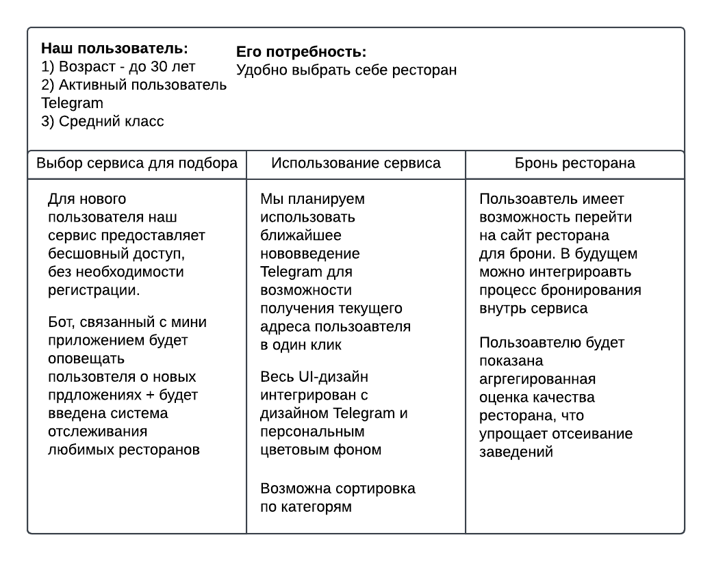
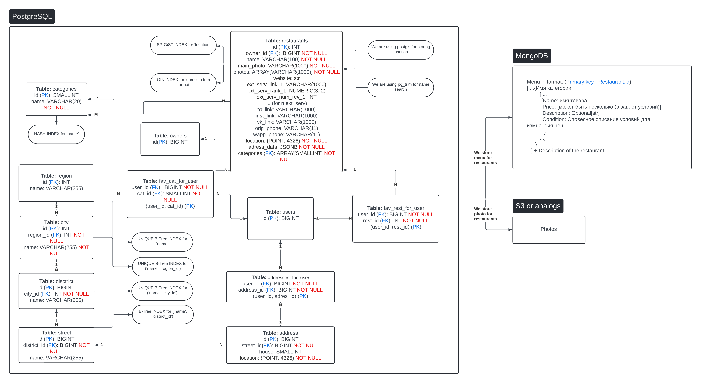

# Тема нашего проекта - Агрегатор ресторанов

# ИНФА ДЛЯ КТ2

## Отчет 

### backend 


### bot 


### frontend 


### databases


### nginx


## Как запустить проект

Создайте в корне проекта .env файл, согласно .env-example

Также создайте по образцу .env файл в директории databases и backend

Теперь можно запустить докер компоуз с нашими контейнерами

```shell
docker-compose up
```

### Вся документация по API находится в Swagger

ссылка на Swagger: http://localhost:8000/docs

ссылка на MiniApp: http://localhost:3000/

На тг бота можно посмотреть на видео, так как мы не можем шерить токен))

## Как протестировать проект локально

Запустите базы данных
```shell
cd databases
docker-compose up
```

### Тестирование бэкенда

```shell
cd ../backend/ # если были в папке databases
python3 -m venv venv
source venv/bin/activate
pip install -r requirements.txt
pytest -v
```
### Тестирование бота

```shell
cd ../bot/
python3 -m venv venv
source venv/bin/activate
pip install -r requirements.txt
pytest -v
```

## ИНФА ДЛЯ КТ1

Мы разрабатываем мини-приложение ТГ для удобной агрегации ресторанов рядом с пользователем. Весь интерфейс будет завязан на телеграм боте

## Функционал

### Для рядового пользователя:
1. Получить ближайшие рестораны к пользователю по введенному адресу 
2. Возможность выбирать любимые рестораны/категории
3. Агрегированная информация о ресторане из несколкьих источников 
4. Система рекомендаций от бота

### Для фирм:
1. Добавить/удалить/редактировать свой ресторан через бота 
2. Возможность 'наследования' свойств ресторанов для быстрого добавления новых заведений 
3. Coming soon: Эффективное продвижение для бизнеса за счет отслеживания поведения пользоавтелей 

## Сценарий взаимодействия с нашим проектом

### Consumer Journey Map 


### Основная страница 
Вся вериификация асболютно невидима для пользователя и осущесвляется единожды при входе в приложение, до заверешения сессии 

Вид страницы: 
1. Для нового пользователя

   При входе на главную страницу сервис предложит вам выбрать адрес, в то время как будут показаны рестораны которые примерно близки к вашему текущему местоположению 

2. Для старого пользователя 

   Ваш последний адрес будет сохранен и при следующем входе в приложение, будет отображена страница с ближайшими к нему ресторанами  

На данной странице доступны выбор категорий и адреса, поиск и переход на страницы пользователя и ресторана 
Данная страница всегда кэшируется при переходе на другие, поэтому выбранные категеории, введенные поисковые запросы и.т.п сохраняются, также при возврате на страницу сохраняется положение пользоавтеля на ней

Выбранные категории сохраняются и применяются при поиске

Поиск осуществляется не по точным, а по наибольшим совпадениям, что позоляет искать рестораны максимально удобно для пользоавтеля  

### Страница ресторана 
На данной странице будут продемонстрированы фотографии ресторана, его описание, ссылки на его сайт и на него в других источниках, также там будут показаны рейтинг ресторана на каждом из них, с количеством людей оставивших отзыв и агрегированный рейтинг на основе этих показателей. 

Для каждого заведения будет показан список категорий к кооторому он принадлежит

Также для каждого ресторана в развертывающемся окошке будет доступно меню

У пользователя будет возможность добавить ресторан в избранное или убрать его оттуда 

При наличии возможности, мы бы хотели ввести выкладку по отзывам со всех источников используя Api какой-либо LLM

### Страница пользователя 
Данная страница предназначена для управления всеми фишками мини-приложения

На ней можно будет добавить / удалить любимые категории / рестораны, сбросить предпочтения и.т.п

Дальнейший список функций будет расширяться 

## Ui/UX 

### Главная страница

|  |  |
|-------------------|------------------------------|
|  |  |

P.s выбор адреса в очень сыром виде))

### Страница пользователя 
Cooming soon...

### Страница ресторана 
Same...


## Структура проекта

### Стек проекта:

1. Фронтенд: 
   - React
   - Vite
   - telegram-apps/telegram-ui (для интеграции с интерфейсом тг) 
2. Бэкенд: 
   - python FastAPI (для создания API)
   - SQLAlchemy (для данных пользователей)
   - Celery (фоновые задачи)
   - Redis (для распределения нагрузки на БД и бэк при записи польз. логов)
   - aiobotocor (асинхронная S3 для изображений)

3. Базы данных:
   - PostgreSQL (Основная БД)
   - MongoDB (для меню ресторанов и их описания)

   **Внутри PostgreSQL будем использоавть pg_trim для быстрого поиска по похожим назавниям и postgis для быстрого поиска по ближайшим ресторанам**

4. Контейнеризация через Docker
5. python-telegram-bot для телеграм-бота
6. Api Яндекс карт для работы с географическими данными 

### Что там по архитектуре

Используем микросервисную архитектуру: под фронтенд, бот, бэкенд, все базы данных и утилиты будут созданы контейнеры в Docker.

Бэкенд будет реализован через слоистую архитектуру. \
Делим бэкенд приложения на 3 слоя:
- Слой представления. В этом слое мы будем подготавливаем данные для представления на различных платформах, в нашем случае это будут тг бот и мини-приложение в телеграм 
- Слой сервиса (бизнес-логики). Подготовка данных для сохранения и дальнейшей обработки. Реализует инкапсуляцию бизнес-операций.
- Слой работы с данными. Мы абстрагируем работу с данными, что позволяет бизнес-логике не зависеть от конкретной реализации слоя работы с данными, например, можем легко поменять реляционную БД на нереляционную.

## Реализация этой архитектуры

Мы используем паттерн репозиторий, создавая абстрактный репозиторий для разных целей: один абстрактный для работы с меню ресторана, другой для хранилища фотографий, третий для данных ресторанов и пользователей. \
Для каждого мы будем импелементировать реализацию: для меню будет MongoDB, для фоток S3 (через aiobotocor), для табличек PostreSQL.

Также создаем абстрактный сервис для каждой цели, который будет проводить операции с соответствующим ему абстрактным репозиторием.

В слое представления будут версии для удобного версионирования получившегося API.

Связывать это все будет NGINX, который мы тоже поднимем как отдельный контейнер.

### Схема бд



## Контакты и роли

- Даниэль Минкин (фронтенд + бд), @MinkinDD - автор идеи, писать ему
- Олег Швецов (бэкенд), @olezha223 
