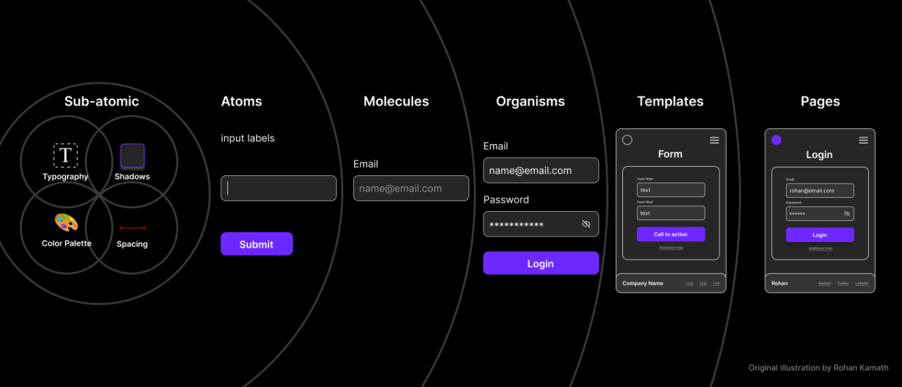

# Фронт

- Для стейт менеджмента использованы React Context и Zustand. Context используется в общем случае где нет риска перерендера, а Zustand как основной стейт менеджер 
- Функциональная и визуальная интеграция с TG реализована через @telegram-apps/telegram-ui
- Структура компонентов выстраивается через ATOM - Atomic Design с небольшими дополнениям (например иконки не выносятся в отд. атомы для удобства)

- Размеры элементов централизованно управляются через styles.css для реализации возможности более тонкой адаптации под мобильные экраны
- Сайт защищен от индексации, так как будет доступен только как мини приложение в TG 
- Кэширование локальных стейтов связанных с MainPage реализовано через react-router-cache-route (например чтобы сохранить выбранные пользователем категории при переходе на страницу ресторана и обратно, без необходимости ручного создания global state через state manager) 

### Структура импортов 
1) Css
2) External lib.
3) State
4) Handlers
5) Webhook
6) Components
7) Icon
8) Utils